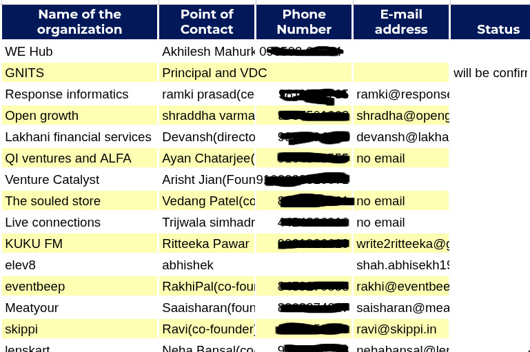
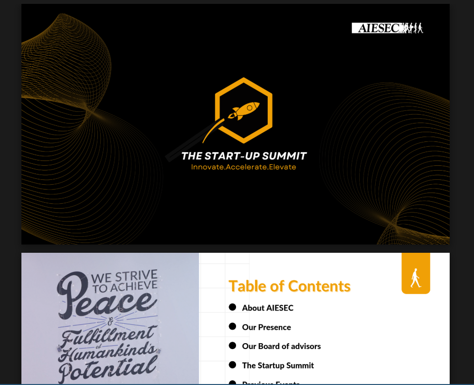

I am primarily a software engineer, but during my undergrad, I spent a lot of time in communities and also did some non-tech work. Today feels like a good day to jot down some thoughts about that time.

## Sophomore year

It started when one of my college mates showed me a video of group of folks dancing to a song, followed by a few videos of conferences they hosted. We both thought they were *cool*.

Apparently, they were an international youth organisation called [AIESEC](https://www.aiesec.in/). It's a non-profit youth org, where they do a lot things blah blah blah.

After giving a few interviews, we ended up joining them, primarily with the motive of ~~getting an internship letter~~.

They have quite a few groups and I ended up in one called **Incoming Global Volunteer**.  Our work is to talk to companies and create internship opportunities for international students to come down and work here for a few months.

So it began!

## MR and frenzy Cold Calling

You first start with data collection, which was called *Market Research*.  You basically fill a excel sheet full of companies, and details of a Point of Contact: their number, email and Linkedin.

So far, Not bad.

Then came cold calling. We had to cold call these people and pitch them about AIESEC, the program, blah blah blah. After a few unsuccessful attempts, I found myself becoming more confident in dialing up people and pitching.

Some people were kind, some were rude and some really hated it when they had already spoken to an _AISECER_ before.

Since then, I started being really polite to promotional callers after experiencing what's its like to be in their shoes :)

## Business Meeting

So, after a successfull cold call you basically setup a meeting with founder or whoever responsible for these kind of initiatives.

You walk them through a **PPT**  answer any questions they have, and if everything goes well, voila!  You closed a deal.

This went on a month or two. Later I went into another department called Business Development

## Walk-ins

Here, our goal was to conduct an event called **The Startup Summit**. It was a 2-day event for startup founders and students.

The process was same, **MR -> Cold Calls -> Meetings, repeat.**

This time, we had to invite speakers and get companies to sponsor money for the event. But this process took up a lot of time and was painful.

Begin Walk-ins !

You basically dress up nicely, make a list of companies, and just **_walk into their offices asking for an appointment_**.

I found that founders are super cool and are usually willing to talk. If everything goes well, the deal is closed right there !

> Fun fact: I got my first gig while walking into a 3D model manufacturing startup and pitching for the event. The founder liked the way I talked and asked me to work for him.

## Pre-event

There would be no point raising money, calling in founders without no audience. So now, it was **selling tickets to students** !

And AGAIN, a LOT of cold calls. I remember doing like 100+ cold calls in a week!

## Conclusion

This might be a usual undergrad experience if you are part of college clubs, but yeah, this was mine.

It was fun meeting founders and cool people in the startup space.

That said, I still have to improve a LOT in communicating clearly.

